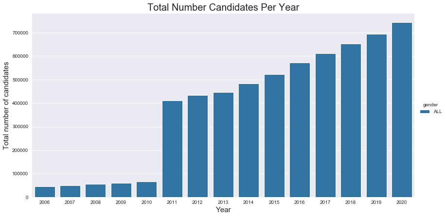
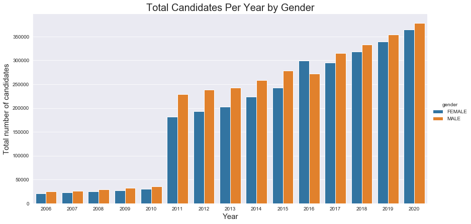
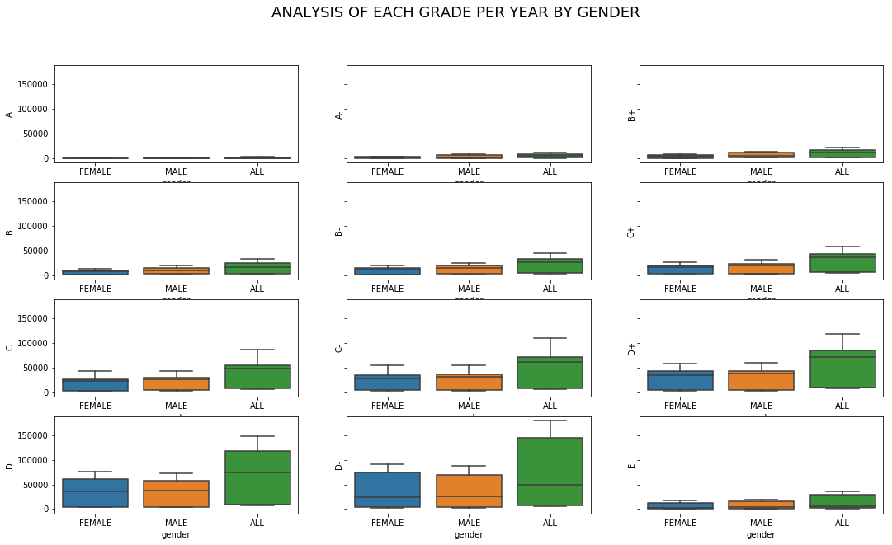
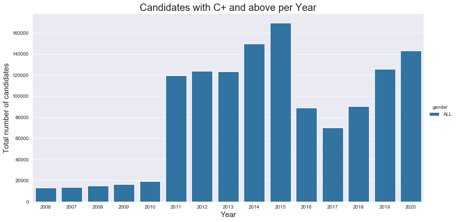
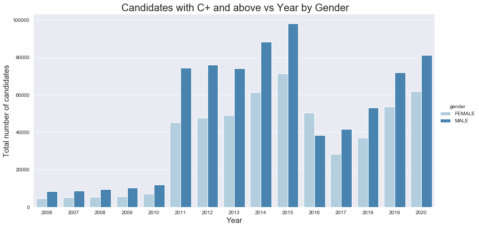
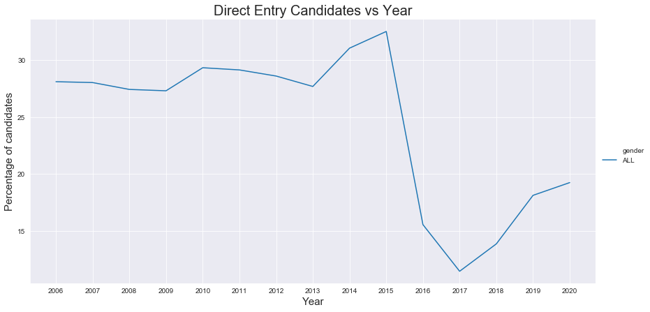
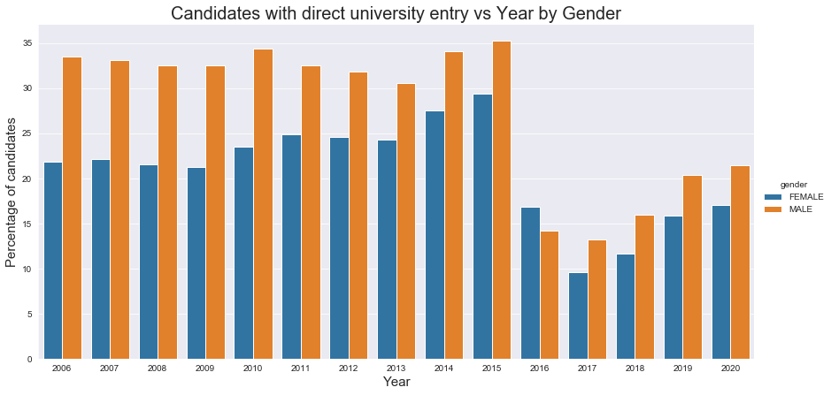

# Data Analysis Report for KCSE results 2006 to 2020

## Table of Contents
* [Introduction](#introduction)
* [Data Collection and Preparation](#data-collection-and-preparation)
* [Methodology](#methodology)
* [Findings](#findings)
* [Conclusion](#conclusion)


## Introduction 
**KCSE** stands for Kenya Certificate of Secondary Education. KCSE exams are done every year academic by students in their final year of high school. The exams are set,administered,marked and results compiled by the Kenya National Examination Council(KNEC). The results are then used to determine a students transition to tertiary institutions using a certain criteria.

In this report , I will document my findings following my analysis of the KCSE results from the year 2006 to 2020.

## Aim
The aim of my analysis is to find out the quality of results based on factors like Gender and Year. I also want to find out how the results have evolved over the years. I want to answer the following questions: 
1. How has the number of students sitting exams evolved over the years?
2. Has the quality of the results improved?
3. Is gender a factor affecting quality of results?
4. How is the transition rate from high school to university based on results?


## Data Collection and Preparation
The initial data was given by our ICT Track instructor which contained results from 2006-2009 and 2015 to 2016. Knec does not have a database from which one can download the data from so the following are resources where I found the missing data, Most of them are reports I had to read and extract data from. 

- KCSE Examination Essential Statistics report by KNEC
- kenyapage.net
- Google
- KCSE results articles by Citixen TV and The Standard 

I then manually updated the excel file to have all years filled.

## Methodology
I used **Python programming language** as my preferred tool. For my notebook and ReadMe I used **Jupyter**.
For data preparation I used **Pandas** and **Numpy** libraries.
For data anaysis I used **Seaborn** and **Matplotlib**.

```Python
    
   import pandas as pd 
   import matplotlib.pyplot as plt
   %matplotlib inline
   import seaborn as sns
   import numpy as np
   ```
   
## Findings
Below are my findings from my analysis.
#### 1. Number of Candidates sitting for KCSE
-As the years progress more students sit for the national exams. Meaning more kenyans are getting an education.


-More males sit for the national exams as compaed to females with an exception of 2016.

#### 2. Quality of results over the years
There are still less higher grades as compared to the lower grades


#### 3. Transition to University for degree courses
-The number of students who get C+ and above increased between 2006 and 2015 before tanking in 2016 and 2017. Between 2018 and 2020 there has been an increase in number of students with C+ and above.

-More male candidates get direct entry to the university as compared to female candidates.


-Between 2006 and 2016 over 25% of candidates got direct entry to universities.

-This percentage decreased from 2016 where between 2016 and 2020 less than 20% of the candidates gained direct entry to university.

-This can be due to the fact that more students sat for exams 2016- 2020 and less students getting C+ and above or other factors like quality of performance in those years.


-A higher percentage of male candidates get direct entry to university however the difference between the percentage of female and male candidaates is improving over the years.


## Conclusion
After my analysis and the above findings I came to a conclusion that:
-More male students sit for exams and get direct entry to the university than female students. this suggests that gender might be a factor affecting the quality of results.

- The percentage of transition to degree courses has decreased over the past few years even with an increase in number of candidates sitting the exams.

-The quality of results is still unsteady with the earlier years showing an improvement but recent years showing a decline in the same.

-So many other factors play a role in the quality of results that might not have been included in the data. To clearly state the exact factors more data would need to be collected.

-What stood out for me is that the difference between male and female students sitting for exams had depriciated meaning the gender gap is reducing with time.

-The dip in 2016 can be attributed to the fact that no moderation was done as it is the norm.

I would suggested that Knec includes other factors or findings in their data like syllabus coverage, type of school,performaance by regiom etc to make the analysis broader.
Knec should also have an updated database with results in relation to several other factors and make it easily accessible.
